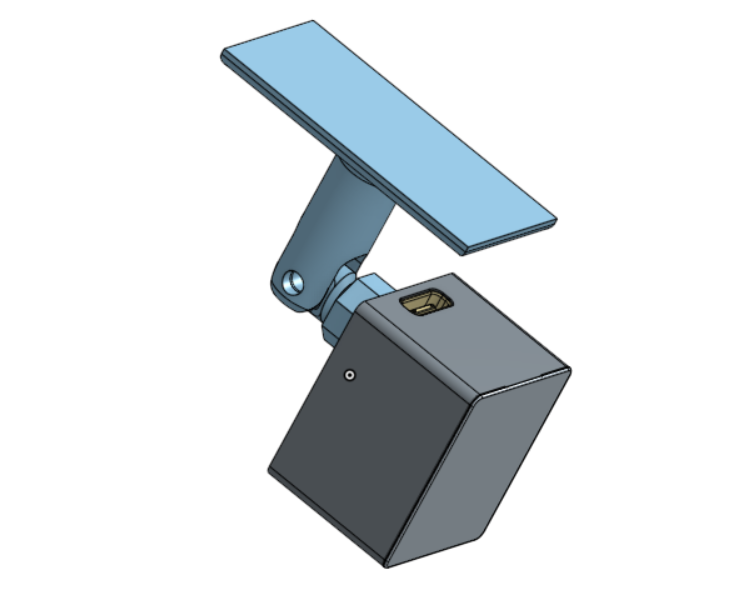
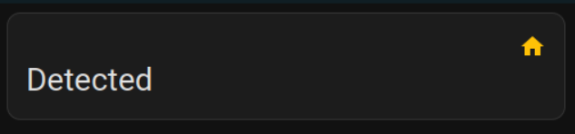

# XIAO ESP32-C6 mmWave Presence Sensor

Zigbee-enabled presence detection sensor using Seeed Studio XIAO hardware, compatible with Home Assistant and other Zigbee 3.0 ecosystems.

 


## 📖 Project Overview

This project combines:
- **[Seeed XIAO ESP32-C6](https://wiki.seeedstudio.com/xiao_esp32c6_getting_started/)** (Wi-Fi 6 + Bluetooth 5 + Zigbee 3.0 SoC)
- **[Seeed XIAO 24GHz mmWave Presence Sensor](https://wiki.seeedstudio.com/mmwave_for_xiao/)**
- Custom 3D-printed enclosure.
- Zigbee 3.0 compatible firmware.

**Key Features** 🌟
- 🏠 Home Assistant compatible out-of-the-box (Zigbee2MQTT/ ZHA).
- 🖨️ Enclosure designs ([STL files](/enclosure)).
- 📶 Supports Zigbee connectivity.

## 📦 Hardware Requirements
- Seeed Studio XIAO ESP32-C6
- Seeed Studio XIAO 24GHz mmWave Presence Sensor
- 3D printed enclosure ([STL files](/enclosure))
- A little bit of solder for soldering pins.
- One M3 bolt (6-10mm) and M3 nut.

## 🛠️ Installation

### 1. Firmware Setup
```bash
# Clone repository
git clone https://github.com/vggscqq/esp32-zigbee-presence.git
```

Change sensor's baud rate to **9600**.
```markdown
> **Note:** When changing the sensor's baud rate using the Android app, the app will always display 256000 as the baud rate even after successfully changing it to a different value. This is a known UI issue in the app - the actual baud rate does get changed correctly despite what is shown in the interface.
```
Flash it with arduino ide. Make sure to select End Device Zigbee mode and Zigbee 4MB with spiffs partition scheme.

## Acknowledgments
* @ [https://github.com/FutureSharks](FutureSharks) for helping with sensor's baud rate bug.
